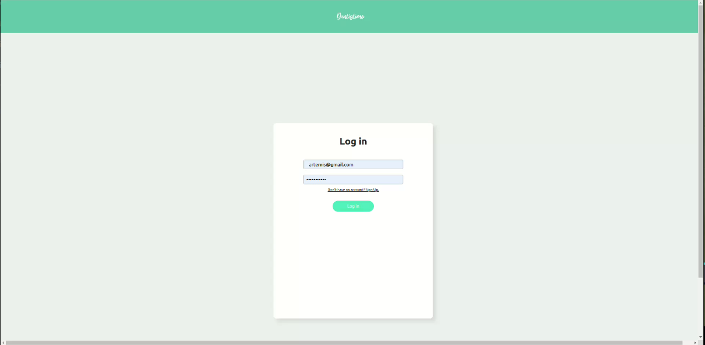
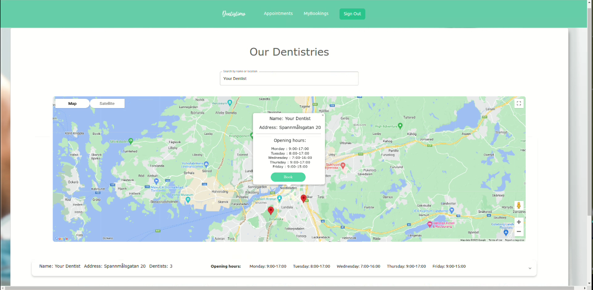
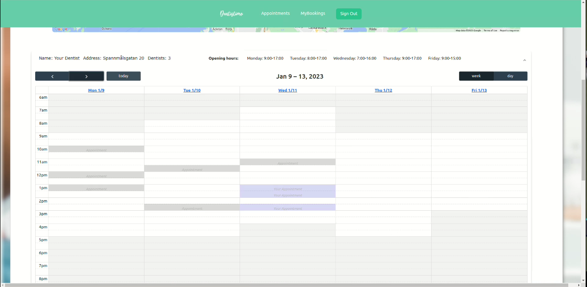
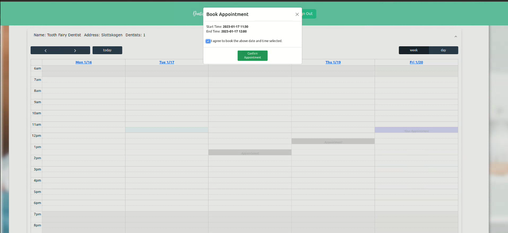
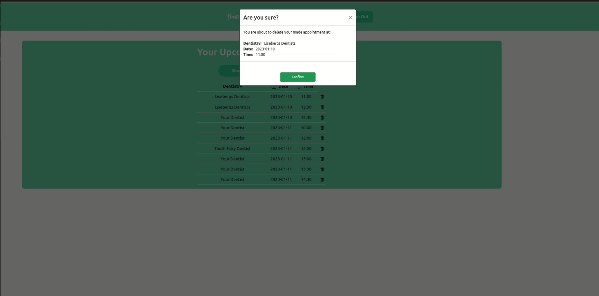

# T2 - Dentistimo User Interface Module

## Description
This is the User Interface module of Team 2's Distributed Systems Project, one out of 4 modules that run concurrently, appearing as one system. This was built using React, and uses communication to other modules via the MQTT protocol.

<br>

## Getting started
To run the dentistimo user interface, you need to clone the repository from Gitlab. You can do this by:

HTTPS
```
git clone https://git.chalmers.se/courses/dit355/dit356-2022/t-2/T2-UserInterface.git
```

SSH
```
git clone git@git.chalmers.se:courses/dit355/dit356-2022/t-2/T2-UserInterface.git
```

## Requirements

- Node V14.21.2 or greater
- Npm V6 or greater
- Mongoose

## Setting up the User Interface
1. Download the necessary libraries/dependencies. Yarn can be good compared to npm, to improve the rate of downloading the deps, and to overcome peer dependency conflicts that npm might suffer with. 
```
cd dentistimo_ui
npm install --legacy-peer-deps
```
> Note: If some errors are shown after installation, one can either 1) run ```npm install --force``` or 2) ```yarn install```. If the error persists, and not all libraries are downloaded, simply run ```npm install <...> ...``` or ```yarn add <...> ...```, replacing <> with the names for the libraries that could not be installed at first.

## Running the User Interface
Alternative 1 (using npm).
```
cd dentistimo_ui
npm start
```
Alternative 2 (using Yarn).
```
cd dentistimo_ui
yarn start
```

<br>

# Pages

## Login Page


## Booking Page - Map View


## Booking Page - Calendar View



## My Appointments Page
Cancelling already booked appointments is done from this page.

